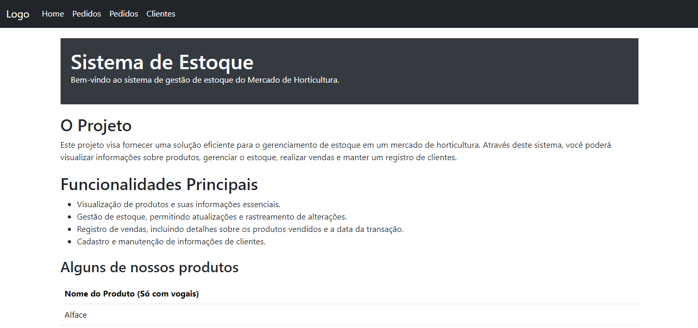
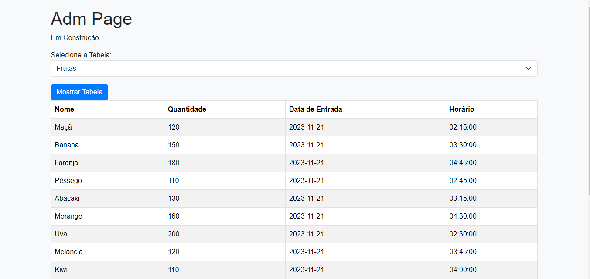

# Sistema de Estoque - Mercado de Horticultura

Bem-vindo ao Sistema de Estoque do Mercado de Horticultura. Este projeto foi desenvolvido para fornecer uma solução eficiente para o gerenciamento de estoque em um mercado de horticultura, permitindo a visualização de produtos, gestão de estoque, registro de vendas e cadastro de clientes.

## Funcionalidades Principais

1. **Visualização de Produtos:**
   - Exiba informações essenciais sobre os produtos disponíveis no mercado.

2. **Gestão de Estoque:**
   - Atualize e rastreie as alterações no estoque, garantindo precisão nas informações.

3. **Registro de Vendas:**
   - Mantenha um histórico de transações de vendas, incluindo detalhes sobre os produtos vendidos e a data da transação.

4. **Cadastro de Clientes:**
   - Registre e gerencie informações sobre os clientes do mercado.

## Tecnologias Utilizadas

- PHP
- MySQL
- Bootstrap (para a interface do usuário)

## Como Iniciar

1. Configure um servidor web local ou use um ambiente de desenvolvimento que suporte PHP e MySQL.
2. Importe o arquivo SQL fornecido (`database.sql`) para criar o banco de dados e as tabelas necessárias.
3. Configure as credenciais do banco de dados no arquivo `config.php`.
4. Execute o projeto no seu navegador.

## Estrutura do Projeto

- **index.php:** Página inicial do sistema.
- **config.php:** Arquivo de configuração para as credenciais do banco de dados.
- **database.sql:** Script SQL para a criação do banco de dados e das tabelas.

## Screen
- Tela Inicial

- Tela de Administrador

## Contribuições

Contribuições são bem-vindas! Se você encontrar problemas ou tiver sugestões de melhorias, sinta-se à vontade para abrir uma issue ou enviar um pull request.

## Licença

Este projeto está licenciado sob a [MIT License](LICENSE).
